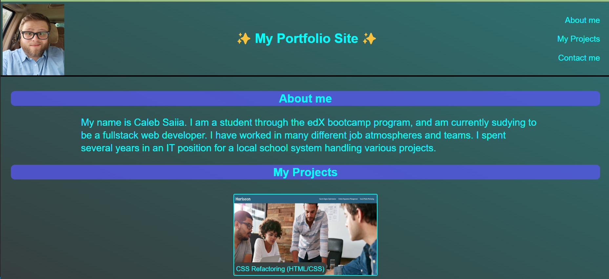

# Portfolio

## Description

This website is a place to direct future employers to see a few of my better projects that are currently deployed. It is a simple but complete page with visual links to both the deployed sites as well as the repositories for each projects. Links to my social accounts as well as ways to contact me, and a short blurb about who I am are included in the site. Having the projects I have worked on in one concise place as well as having some information about myself will make it easier for potential employers to be able to see what I am capable of as well as get to know me.

## Installation

No installation is required. To access the website just click 

## Usage
The usage of the site is fairly self-explanatory. Using the navigation buttons in the header, you can scroll to specific areas of the page. By hovering over the images you are given the option to view either the deployed site or the repository for the project. Alternatively, you can click on the images themselves and be directed to the deployed project. If you fill out the form in the contact section with your information, then I can get back to you in response to your comments. I can be reached at any of the listed forms of communication as well.

